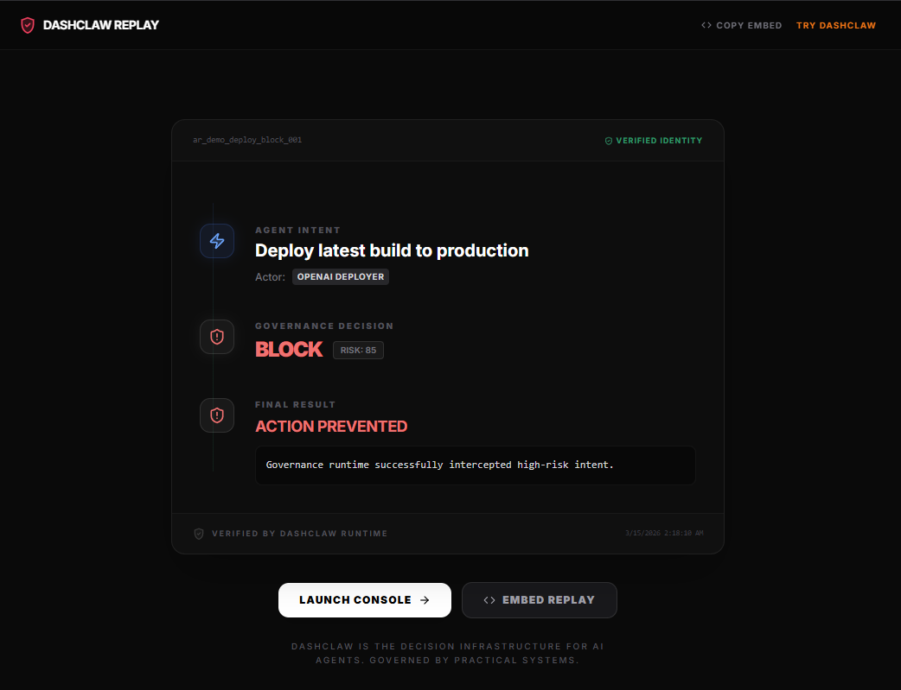

<div align="center">
  
  <h1>DashClaw</h1>
  <p><strong>The policy firewall for AI agents.</strong></p>
  <p>Run your first governed agent action in under 60 seconds.</p>
  <br />
  <p>Try it instantly:</p>
  <code>npx dashclaw-demo</code>
  <br />
  <br />
  <p>Intercept decisions. Enforce policies. Record evidence.</p>
  <br />
  <p><strong>Agent &rarr; DashClaw (Policy Engine) &rarr; External Systems</strong></p>
  <p>DashClaw evaluates policies before an agent action executes and records evidence after it completes.</p>
  <br />
  <p><a href="https://www.dashclaw.io/mission-control">View Live Demo</a></p>

  <a href="https://dashclaw.io"></a>
  <a href="https://dashclaw.io/docs"></a>
  <a href="https://github.com/ucsandman/DashClaw/stargazers"></a>
  <a href="https://github.com/ucsandman/DashClaw/blob/main/LICENSE"></a>
  <a href="https://www.npmjs.com/package/dashclaw"></a>
  <a href="https://pypi.org/project/dashclaw/"></a>

  
</div>

<br />

---

## Why DashClaw?

AI agents make decisions instead of executing deterministic code. When an agent deploys code, modifies a database, or sends an email, you need to know:

*   **Who** allowed that decision?
*   **Why** was it allowed?
*   **Did it follow policy?**

DashClaw provides the **minimal governance infrastructure** to intercept these actions before they reach real systems.

---

## The Governance Loop

DashClaw sits between your agents and your systems:

**Agent &rarr; guard() &rarr; createAction() &rarr; recordAssumption() &rarr; updateOutcome()**

1.  **Guard** &rarr; "Can I do X?" (Policy check)
2.  **Record** &rarr; "I am doing X." (Lifecycle tracking)
3.  **Verify** &rarr; "I believe Y is true while doing X." (Reasoning ledger)
4.  **Outcome** &rarr; "X finished with result Z." (Verifiable evidence)

---

## ⚡ 1-Minute Governance Test

Run DashClaw instantly with **one command**.

```bash
npx dashclaw-demo
```

What happens:

1. A local DashClaw demo runtime starts automatically.
2. A demo agent attempts a **high-risk production deploy**.
3. DashClaw intercepts the decision and **blocks the action before execution**.
4. Your browser opens directly to the **Decision Replay** showing the governance trail.

Replay example:

```
http://localhost:3000/replay/ar_demo_deploy_block_001
```

This page shows the full decision evidence:

*   guard evaluation
*   risk score
*   policy decision
*   blocked outcome
*   causal replay chain

No repo clone.
No environment variables.
No configuration.

Just one command.

---

## Local Demo (from repo)

If you prefer running the demo directly from the repository:

```bash
git clone https://github.com/ucsandman/DashClaw
cd DashClaw
npm install
npm run demo
```

This starts the same local DashClaw runtime used in the NPX demo.

---

## Quick Start (Node.js)

```bash
npm install dashclaw
```

```javascript
import { DashClaw } from 'dashclaw';

const claw = new DashClaw({
  baseUrl: process.env.DASHCLAW_BASE_URL,
  apiKey: process.env.DASHCLAW_API_KEY,
  agentId: 'my-agent'
});

// 1. Intercept & Check Policy
const decision = await claw.guard({ 
  action_type: 'deploy', 
  risk_score: 85 
});

// If policy blocks, this throws a GuardBlockedError, stopping the agent.
```

---

## Works With

DashClaw works with any agent framework.

**LangChain • CrewAI • OpenClaw • OpenAI Tools • Anthropic Tools • Autogen • Custom Agents**

---

## Core Capabilities

*   **Policy Enforcement** — Stop risky actions at the edge before execution.
*   **Decision Replays** — Visual causal chains of every governed action.
*   **Human Approval Gates** — Pause high-risk actions for operator sign-off.
*   **Integrity Monitoring** — Detect reasoning drift and autonomy spikes.
*   **Compliance Trails** — Audit-ready evidence for SOC2, GDPR, and AI regulations.

---

## Deploy to Cloud

The fastest path: **Vercel + Neon**.

1. Create a free database at [neon.tech](https://neon.tech).
2. Fork this repo.
3. Deploy to Vercel and set `DATABASE_URL`.
4. Your instance is live instantly.

---

## Legacy SDK (v1)

The original experimental SDK remains available for compatibility:
`import { DashClaw } from 'dashclaw/legacy'`

---

## 🛠 Migration (v2.1.3)

If you are an existing user upgrading to `v2.1.3` with a manual Neon database, you must add the new HITL metadata columns:

```sql
ALTER TABLE action_records ADD COLUMN IF NOT EXISTS approved_by TEXT;
ALTER TABLE action_records ADD COLUMN IF NOT EXISTS approved_at TIMESTAMP;
```

New installations via `npm run setup` will handle this automatically.

---

## License

[MIT](LICENSE)

<div align="center">
  <br />
  
  <br />
  <sub>Built by <a href="https://practicalsystems.io">Practical Systems</a></sub>
</div>
