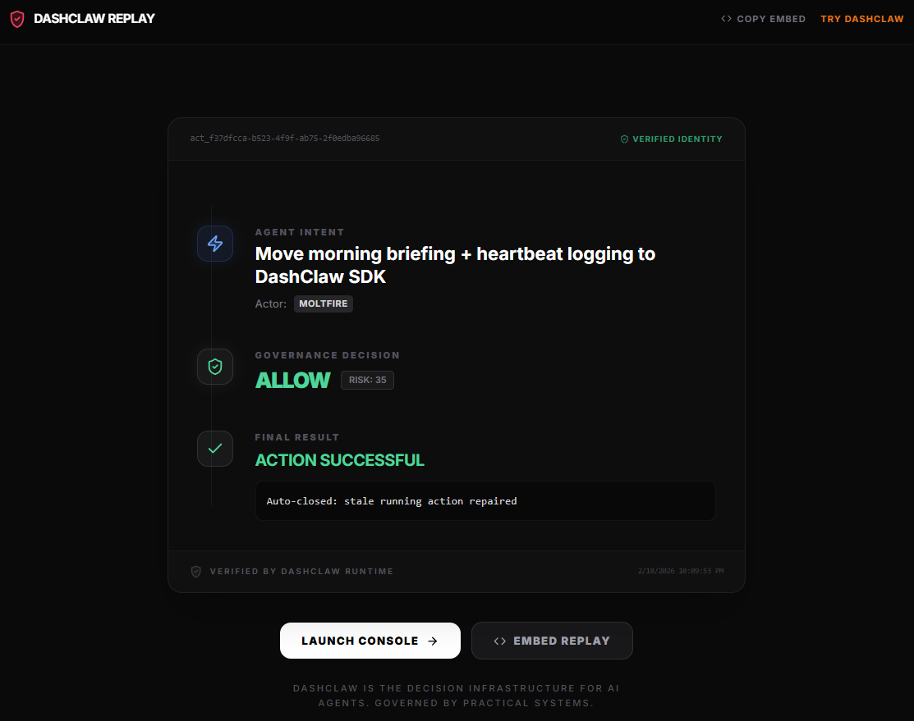

<div align="center">
  
  <h1>DashClaw</h1>
  <p><strong>Decision infrastructure for AI agents</strong></p>
  <p>Intercept. Govern. Verify.</p>
  <p>DashClaw is a policy firewall that intercepts agent actions before they reach real systems.</p>
  <br />
  <p><strong>Agent &rarr; DashClaw (Policy Engine) &rarr; External Systems</strong></p>
  <br />
  <p><a href="https://www.dashclaw.io/mission-control">View Demo</a></p>

  <a href="https://dashclaw.io"></a>
  <a href="https://dashclaw.io/docs"></a>
  <a href="https://github.com/ucsandman/DashClaw/stargazers"></a>
  <a href="https://github.com/ucsandman/DashClaw/blob/main/LICENSE"></a>
  <a href="https://www.npmjs.com/package/dashclaw"></a>
  <a href="https://pypi.org/project/dashclaw/"></a>

  
</div>

<br />

---

## Why DashClaw Exists

AI agents don't just generate text — they execute actions. They deploy code, modify databases, and interact with production systems.

DashClaw provides the **minimal governance infrastructure** to intercept these actions before they happen.

---

## The Minimal Governance Loop

DashClaw sits between your agents and your systems:

1. **Guard** &rarr; `claw.guard()` checks intent against policy.
2. **Record** &rarr; `claw.createAction()` logs the attempt.
3. **Verify** &rarr; `claw.recordAssumption()` tracks the "why" to detect reasoning drift.
4. **Outcome** &rarr; `claw.updateOutcome()` records the final evidence.

---

## Quick Start (Node.js)

```bash
npm install dashclaw
```

```javascript
import { DashClaw } from 'dashclaw';

const claw = new DashClaw({
  baseUrl: process.env.DASHCLAW_BASE_URL,
  apiKey: process.env.DASHCLAW_API_KEY,
  agentId: 'my-agent'
});

// 1. Ask for permission
const decision = await claw.guard({ 
  action_type: 'deploy', 
  risk_score: 85 
});

// 2. Record the action
const action = await claw.createAction({
  action_type: 'deploy',
  declared_goal: 'Deploying latest build'
});

// 3. Record the result
await claw.updateOutcome(action.action_id, { 
  status: 'completed' 
});
```

---

## Minimal SDK Surface (v2)

DashClaw v2 is optimized for first-time adoption with only **5 core methods**:

*   `guard(context)` — Policy evaluation ("Can I do X?")
*   `createAction(action)` — Lifecycle tracking ("I am doing X")
*   `updateOutcome(id, outcome)` — Result recording ("X finished with Y")
*   `recordAssumption(assumption)` — Integrity tracking ("I believe Z while doing X")
*   `waitForApproval(id)` — Polling helper for human-in-the-loop

### Legacy SDK (v1)
The original 178-method SDK remains available via the legacy sub-path for users who require experimental platform features:
```javascript
import { DashClaw } from 'dashclaw/legacy';
```

---

## Minimal Runtime API

DashClaw provides a small, stable API surface for governing any agent:

1. **`POST /api/guard`** — Policy check.
2. **`POST /api/actions`** — Action registration.
3. **`PATCH /api/actions/:id`** — Outcome recording.
4. **`POST /api/assumptions`** — Reasoning ledger.
5. **`POST /api/approvals/:id`** — Human-in-the-loop.

---

## Core Capabilities

- **Mission Control** — High-level control tower for fleet posture and active interventions.
- **Guard Engine** — Zero-latency policy enforcement before agents reach external systems.
- **Decision Replay** — Visual, shareable causal chains of every governed action.
- **Risk Signals** — Automated detection of autonomy spikes and failure loops.
- **Compliance Evidence** — Generate audit-ready reports for SOC 2, GDPR, and EU AI Act.

---

## 🚀 8-Minute Path to Governance

Experience the magic of autonomous governance in minutes.

```bash
# 1. Clone the repo
git clone https://github.com/ucsandman/DashClaw
cd DashClaw

# 2. Run the example
cd examples/dashclaw-example-openai-agent
npm install
node index.js
```

---

## Works With Your Agent Stack

DashClaw can govern decisions from any agent runtime:
• LangChain • CrewAI • OpenAI Tools • Anthropic Tools • Custom Frameworks

---

## How It Works

DashClaw is a single Next.js codebase that serves as both a marketing site and a self-hosted governance control plane.

| Feature | **dashclaw.io** (demo) | **Your deployment** (self-host) |
|---|---|---|
| **Data** | Hardcoded fixtures | Your Postgres database |
| **`DASHCLAW_MODE`** | `demo` | `self_host` (default) |

---

## Deploy to Cloud

The fastest path: **Vercel free tier + Neon free tier**.

1. Create a free database at [neon.tech](https://neon.tech)
2. Fork this repo to your GitHub
3. Import at [vercel.com/new](https://vercel.com/new)
4. Set environment variables (see [docs/client-setup-guide.md](docs/client-setup-guide.md)).

---

## Security

- API surface fails closed with `503` if `DASHCLAW_API_KEY` is not set.
- AES-256 encryption for sensitive settings.
- Multi-tenant isolation by default.

---

## License

[MIT](LICENSE) -- use it however you want.

<div align="center">
  <br />
  
  <br />
  <sub>Built by <a href="https://practicalsystems.io">Practical Systems</a></sub>
</div>
