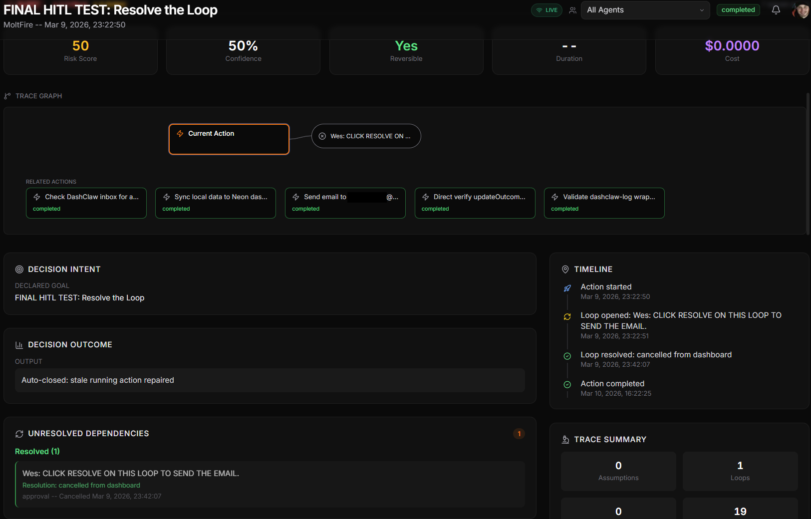

<div align="center">
  
  <h1>DashClaw</h1>
  <p><strong>Decision infrastructure for AI agents</strong></p>
  <p>AI Agent Governance Runtime</p>
  <p>Intercept. Govern. Verify.</p>
  <p>DashClaw is a policy firewall that intercepts agent actions before they reach real systems.</p>
  <p>MIT Licensed &bull; Self-hosted &bull; Zero-dependency SDK &bull; Node + Python &bull; Open source</p>
  <br />
  <p><strong>Agents &rarr; DashClaw &rarr; External Systems</strong></p>
  <br />
  <p><a href="https://www.dashclaw.io/mission-control">View Demo</a></p>

  <a href="https://dashclaw.io"></a>
  <a href="https://dashclaw.io/docs"></a>
  <a href="https://github.com/ucsandman/DashClaw/blob/main/LICENSE"></a>
  <a href="https://www.npmjs.com/package/dashclaw"></a>
  <a href="https://pypi.org/project/dashclaw/"></a>

  </div>

<br />

---

## 30-Second Quick Start

**1. Run DashClaw locally**
```bash
git clone https://github.com/ucsandman/DashClaw.git
cd DashClaw
node scripts/setup.mjs
```

**2. Install the SDK**
```bash
npm install dashclaw
```

**3. Guard your agent**
```javascript
import { DashClaw } from 'dashclaw';

const claw = new DashClaw({
  baseUrl: 'http://localhost:3000',
  apiKey: 'oc_live_...',
  agentId: 'deployment-bot'
});

// Intercept before you act
const { decision } = await claw.guard({
  actionType: 'deploy',
  riskScore: 85
});

if (decision === 'allowed') {
  // execute real-world action
}
```

---

## Where DashClaw Runs

DashClaw intercepts agent actions before they reach real systems.

```
AI Agent
(OpenAI, Claude, CrewAI, OpenClaw)
        │
        │ actions
        ▼
     DashClaw
 Decision Runtime
        │
        ├ Policy evaluation
        ├ Approval workflows
        └ Decision evidence
        │
        ▼
External Systems
GitHub • APIs • Databases • Infrastructure
```

DashClaw becomes the enforcement layer between agent intent and real-world execution.

---

## Category

DashClaw introduces **Decision Infrastructure for AI agents**.

Traditional infrastructure governs code execution. DashClaw governs autonomous agent decisions. It ensures that when an LLM decides to take an action, that action is evaluated against organizational policies before it reaches production systems.

---

## Why This Exists

Most observability tools tell you *what* your agents did. 

**Observability shows what agents did. DashClaw governs what they are allowed to do.**

DashClaw tells you *what they decided, why, whether they should have, and how to prevent the next bad decision.*

---

## How DashClaw Is Different

Most tools today focus on **observability** (logs and traces after the fact). DashClaw focuses on **governing agent decisions before execution**.

| Tool Category | What It Does | When It Runs |
|---------------|--------------|--------------|
| Observability tools | Logs, traces, monitoring | After an action |
| Agent frameworks | Plan and execute tasks | During execution |
| Evaluation tools | Score outputs | After execution |
| **DashClaw** | **Enforce policies and approvals** | **Before execution** |

### DashClaw vs Agent Observability
Observability tools answer "What happened?". DashClaw answers "Should the agent have been allowed to do that?"

### DashClaw vs Guardrails
Guardrails typically validate prompts and LLM outputs. DashClaw governs real-world actions and side effects.

### DashClaw vs Agent Frameworks
Frameworks (like LangChain or CrewAI) help you build agents. DashClaw provides the infrastructure to govern them in production.

---

## Works With

OpenAI | Anthropic | LangChain | CrewAI | AutoGen | OpenClaw | Custom Agents

DashClaw works with any agent capable of making API calls.

---

## What Developers Use DashClaw For

### Prevent risky deployments
Intercept deploy commands from agents and require manual approval when risk thresholds are exceeded.
```js
await claw.guard({
  actionType: "deploy",
  environment: "production"
});
```

### Control autonomous API usage
Limit spending and prevent dangerous actions when agents interact with third-party APIs like Stripe or AWS.
```js
await claw.guard({
  actionType: "external_api_call",
  provider: "stripe",
  amount: 2000
});
```

### Detect reasoning drift
Track the assumptions agents rely on and automatically flag when those assumptions diverge from reality.

### Produce audit trails
Every governed action generates structured evidence records ready for compliance review and debugging.

---

## Core Runtime

DashClaw is built around the **Decision Lifecycle**, providing a runtime for autonomous systems:

- **Mission Control** -- Control tower for fleet posture and real-time governance.
- **Guard** -- Evaluate policies before an action executes.
- **Decisions Ledger** -- Global stream of governed agent decisions.
- **Agent Governance Dossier** -- Dedicated profile for every agent (posture, active policies, history).
- **Decision Replay** -- Specialized causal chain visualization of a single decision.
- **Public Permalinks** -- Shareable, public-safe decision stories for audit and storytelling.
- **Assumptions** -- Track what the agent believed to be true when making a decision.
- **Approvals** -- Pause risky actions for human review.
- **Evidence** -- Produce verifiable, audit-ready decision trails.

---

## Example Architecture

```
LLM Agent
   │
LangChain / CrewAI
   │
DashClaw Guard
   │
Production Systems
```

---

## Platform Expansion

Once decisions are governed, DashClaw expands into a full control plane for agent fleets:

- **Mission Control dashboard** — operational visibility for agent fleets.
- **Decision Replay** — causal chain visualization for every governed action.
- **Agent Fleet Management** — health, permissions, and health overview.
- **Compliance evidence** — generate audit-ready reports.


---

## How It Works

DashClaw is a single Next.js codebase that serves two roles:

| | **dashclaw.io** (marketing) | **Your deployment** (self-hosted) |
|---|---|---|
| **Landing page** | Marketing site with demo | Same page, "Mission Control" goes to your real dashboard |
| **Mission Control** | Demo with fixture data, no login | Real dashboard with Password or GitHub/Google/OIDC OAuth |
| **Data** | Hardcoded fixtures | Your Postgres database |
| **`DASHCLAW_MODE`** | `demo` | `self_host` (default) |

---

## Product Surfaces

| Route | Description | Tier |
|-------|-------------|------|
| `/mission-control` | Control tower for agent fleet posture | Core |
| `/decisions` | Decisions Ledger: global stream of governed actions | Core |
| `/decisions/[id]` | Decision Replay: visual causal chain of a decision | Core |
| `/policies` | Guardrail and policy management | Core |
| `/agents` | Fleet overview and agent dossiers | Supporting |
| `/activity` | Real-time operational telemetry feed | Supporting |
| `/labs` | Experimental safety research (Swarm, Learning, Prompts) | Experimental |
| `/audit-log` | Immutable record of system/admin changes | Core |

---

## Deploy to Cloud

The fastest path: **Vercel free tier + Neon free tier**.

1. Create a free database at [neon.tech](https://neon.tech)
2. Fork this repo to your GitHub
3. Import at [vercel.com/new](https://vercel.com/new)
4. Generate secrets and set environment variables (see [docs/client-setup-guide.md](docs/client-setup-guide.md)).
5. Deploy. Tables are created automatically on first request.

---

## Security

- API surface fails closed with `503` if `DASHCLAW_API_KEY` is not set.
- Rate limiting enforced on all `/api/*` routes.
- AES-256 encryption for sensitive settings.
- Multi-tenant isolation by default.

See [docs/SECURITY.md](docs/SECURITY.md).

---

## Community

<div align="center">
  <a href="https://dashclaw.io">Website</a> &bull;
  <a href="https://dashclaw.io/docs">Documentation</a> &bull;
  <a href="https://github.com/ucsandman/DashClaw/issues">Issues</a>
</div>

---

## License

[MIT](LICENSE) -- use it however you want.

<div align="center">
  <br />
  
  <br />
  <sub>Built by <a href="https://practicalsystems.io">Practical Systems</a></sub>
</div>
