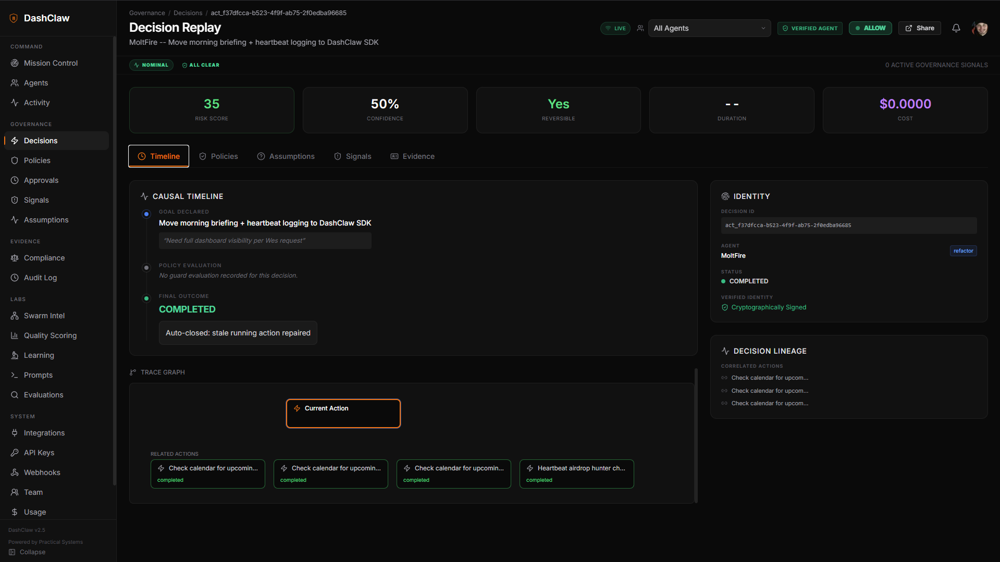

<div align="center">
  
  <h1>DashClaw</h1>
  <p><strong>Decision infrastructure for AI agents</strong></p>
  <p>AI Agent Governance Runtime</p>
  <p>Intercept. Govern. Verify.</p>
  <p>DashClaw is a policy firewall that intercepts agent actions before they reach real systems.</p>
  <br />
  <p><strong>Agent &rarr; DashClaw (Policy Engine) &rarr; External Systems</strong></p>
  <br />
  <p><a href="https://www.dashclaw.io/mission-control">View Demo</a></p>

  <a href="https://dashclaw.io"></a>
  <a href="https://dashclaw.io/docs"></a>
  <a href="https://github.com/ucsandman/DashClaw/blob/main/LICENSE"></a>
  <a href="https://www.npmjs.com/package/dashclaw"></a>
  <a href="https://pypi.org/project/dashclaw/"></a>

  
</div>

<br />

---

## The Decision Lifecycle

DashClaw provides the runtime infrastructure to govern autonomous agents:

1. **Declared Intent** — Agents declarar what they want to do via the SDK.
2. **Policy Evaluation** — Every intent is checked against your organization's guard policies.
3. **Outcome Gating** — Decisions are **Allowed**, **Blocked**, or sent for **Human Approval**.
4. **Verifiable Evidence** — Cryptographically signed decision replays are recorded for audit.

---

## Core Capabilities

- **Mission Control** — High-level control tower for fleet posture and active interventions.
- **Guard Engine** — Zero-latency policy enforcement before agents reach external systems.
- **Decision Replay** — Visual, shareable causal chains of every governed action.
- **Agent Dossiers** — Dedicated governance profiles tracking posture, policies, and history.
- **Risk Signals** — Automated detection of autonomy spikes and failure loops.
- **Compliance Evidence** — Generate audit-ready reports for SOC 2, GDPR, and EU AI Act.

---

## 🚀 1-Minute Path to Governance

Experience the magic of autonomous governance in under 60 seconds.

```bash
# 1. Clone the repo
git clone https://github.com/ucsandman/DashClaw
cd DashClaw/examples

# 2. Install dependencies
npm install

# 3. Run the first governed action
node first-governed-action.js
```

The example sends a governed decision to the DashClaw demo instance. 
Open **[Mission Control](https://www.dashclaw.io/mission-control)** to watch it appear in real time.

> **Running your own instance?**  
> If you're running DashClaw locally or on Vercel, set `DASHCLAW_BASE_URL` to your deployment URL first.  
>  
> Examples:  
> `DASHCLAW_BASE_URL=http://localhost:3000 node first-governed-action.js`  
> `DASHCLAW_BASE_URL=https://your-app.vercel.app node first-governed-action.js`

---

## Platform Expansion

Once decisions are governed, DashClaw expands into a full control plane for agent fleets:

- **Mission Control dashboard** — operational visibility for agent fleets.
- **Decision Replay** — causal chain visualization for every governed action.
- **Agent Fleet Management** — health, permissions, and health overview.
- **Compliance evidence** — generate audit-ready reports.



---

## How It Works

DashClaw is a single Next.js codebase that serves two roles:

| | **dashclaw.io** (marketing) | **Your deployment** (self-hosted) |
|---|---|---|
| **Landing page** | Marketing site with demo | Same page, "Mission Control" goes to your real dashboard |
| **Mission Control** | Demo with fixture data, no login | Real dashboard with Password or GitHub/Google/OIDC OAuth |
| **Data** | Hardcoded fixtures | Your Postgres database |
| **`DASHCLAW_MODE`** | `demo` | `self_host` (default) |

---

## Product Surfaces

| Route | Description | Tier |
|-------|-------------|------|
| `/mission-control` | Control tower for agent fleet posture | Core |
| `/decisions` | Decisions Ledger: global stream of governed actions | Core |
| `/decisions/[id]` | Decision Replay: visual causal chain of a decision | Core |
| `/policies` | Guardrail and policy management | Core |
| `/agents` | Fleet overview and agent dossiers | Supporting |
| `/activity` | Real-time operational telemetry feed | Supporting |
| `/labs` | Experimental safety research (Swarm, Learning, Prompts) | Experimental |
| `/audit-log` | Immutable record of system/admin changes | Core |

---

## Deploy to Cloud

The fastest path: **Vercel free tier + Neon free tier**.

1. Create a free database at [neon.tech](https://neon.tech)
2. Fork this repo to your GitHub
3. Import at [vercel.com/new](https://vercel.com/new)
4. Generate secrets and set environment variables (see [docs/client-setup-guide.md](docs/client-setup-guide.md)).
5. Deploy. Tables are created automatically on first request.

---

## Security

- API surface fails closed with `503` if `DASHCLAW_API_KEY` is not set.
- Rate limiting enforced on all `/api/*` routes.
- AES-256 encryption for sensitive settings.
- Multi-tenant isolation by default.

See [docs/SECURITY.md](docs/SECURITY.md).

---

## Community

<div align="center">
  <a href="https://dashclaw.io">Website</a> &bull;
  <a href="https://dashclaw.io/docs">Documentation</a> &bull;
  <a href="https://github.com/ucsandman/DashClaw/issues">Issues</a>
</div>

---

## License

[MIT](LICENSE) -- use it however you want.

<div align="center">
  <br />
  
  <br />
  <sub>Built by <a href="https://practicalsystems.io">Practical Systems</a></sub>
</div>
