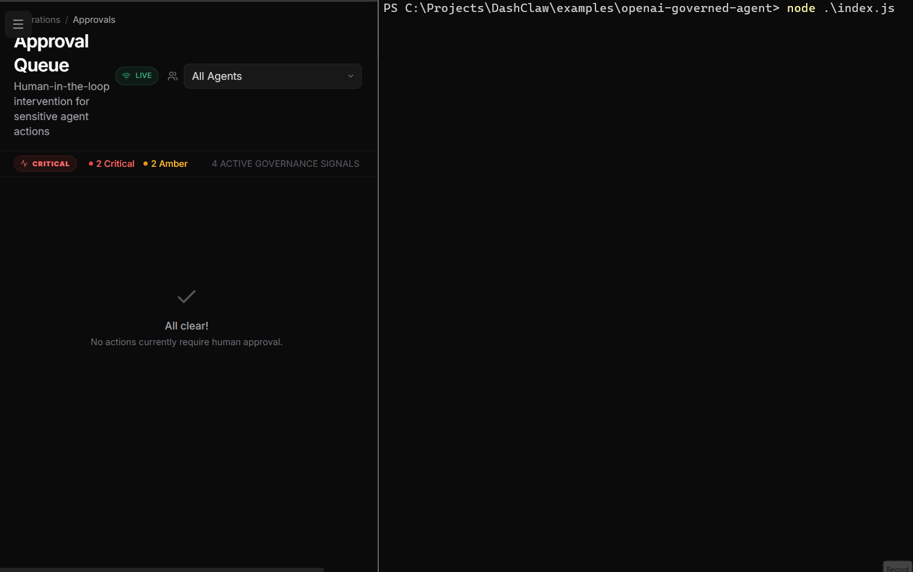
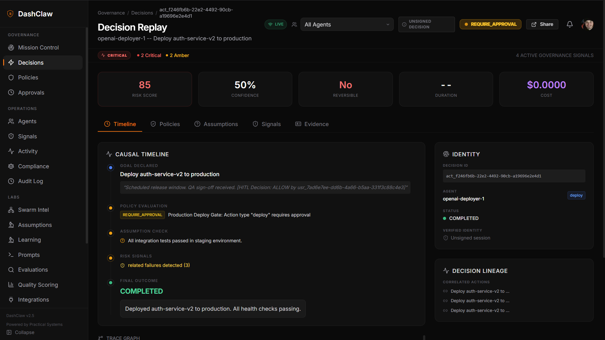
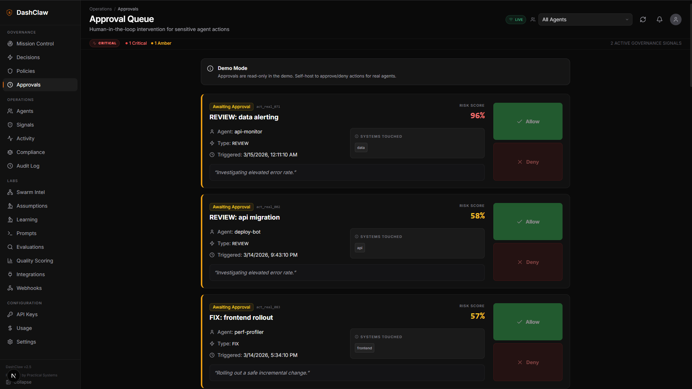
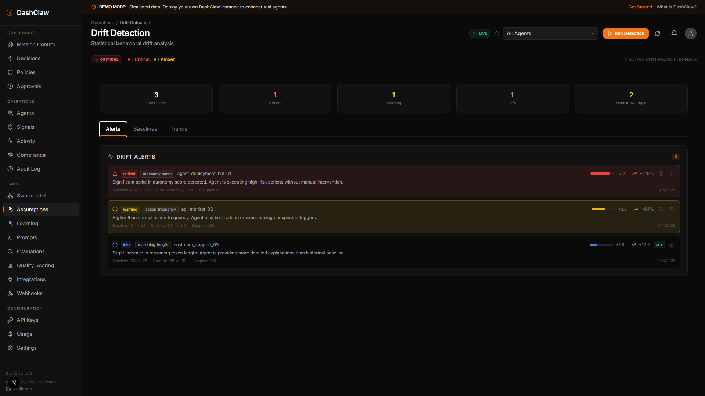

<div align="center">
  
  <h1>DashClaw</h1>
  <p><strong>Decision Infrastructure for AI agents.</strong></p>
  <p>Stop agents before they make expensive mistakes.</p>
  <br />
  <h3>Try it in 10 seconds</h3>
  <pre><code>npx dashclaw-demo</code></pre>

  <p><sub>No setup. Opens Decision Replay automatically.</sub></p>

  

<br />
<p><strong>Works with:</strong></p>
<p>LangChain • CrewAI • OpenClaw • OpenAI • Anthropic • AutoGen • Claude Code • Codex • Gemini CLI • Custom agents</p>
  <br />
  <p>Intercept decisions. Enforce policies. Record evidence.</p>
  <br />
  <p><strong>Agent &rarr; DashClaw &rarr; External Systems</strong></p>
  <p>DashClaw sits between your agents and your external systems. It evaluates policies before an agent action executes and records verifiable evidence of every decision.</p>
  <br />
  <p><a href="https://dashclaw.io/demo">View Live Demo</a></p>

  <a href="https://dashclaw.io"></a>
  <a href="https://dashclaw.io/docs"></a>
  <a href="https://github.com/ucsandman/DashClaw/stargazers"></a>
  <a href="https://github.com/ucsandman/DashClaw/blob/main/LICENSE"></a>
  <a href="https://www.npmjs.com/package/dashclaw"></a>
  <a href="https://pypi.org/project/dashclaw/"></a>

</div>

<br />

---

## What is DashClaw?

DashClaw is not observability. It is **control before execution**.

AI agents generate actions from goals and context. They do not follow deterministic code paths. Therefore debugging alone is insufficient. **Agents require governance.**

DashClaw provides decision infrastructure to:
* Intercept risky agent actions.
* Enforce policy checks before execution.
* Require human approval (HITL) for sensitive operations.
* Record verifiable decision evidence to detect reasoning drift.

---

## ⚡ See DashClaw stop an agent from deleting production data

Run DashClaw instantly with **one command**.

```bash
npx dashclaw-demo
```

What happens:
1. A local DashClaw demo runtime starts automatically.
2. A demo agent attempts a **high-risk production deploy**.
3. DashClaw intercepts the decision and **blocks the action before execution**.
4. Your browser opens directly to the **Decision Replay** showing the governance trail.

No repo clone. No environment variables. No configuration. Just one command.

---

### What you’ll see

- 🔴 High risk score (85)
- 🛑 Policy requires approval before deploy
- 🧠 Assumptions recorded by the agent
- 📊 Full decision timeline with outcome



---

## Platform Overview

<div align="center">

**Mission Control** — Real-time strategic posture, decision timeline, and intervention feed.


<br /><br />

**Approval Queue** — Human-in-the-loop intervention with risk scores and one-click Allow / Deny.



<br /><br />

**Guard Policies** — Declarative rules that govern agent behavior before actions execute.


<br /><br />

**Drift Detection** — Statistical behavioral drift analysis with critical alerts when agents deviate from baselines.



</div>

---

## 🏗️ First Real Agent (5-Minute Integration)

Ready to connect your own agent? Use the **OpenAI Governed Agent Starter** to see DashClaw in a real customer communication workflow.

```bash
# 1. Enter the starter directory
cd examples/openai-governed-agent

# 2. Install and run
npm install
cp .env.example .env
# Add your DASHCLAW_API_KEY to .env
node index.js
```

What it proves:
- **Governance Before Execution**: `claw.guard()` checks policies *before* the action.
- **Permissioned Autonomy**: Pausing for human approval (HITL) on high-risk actions.
- **Verifiable Evidence**: Intent, assumptions, and outcomes recorded in your dashboard.

[View the Starter Source](./examples/openai-governed-agent)

---

## Quickstart

### 1. Install the SDK

**Node.js:**
```bash
npm install dashclaw
```

**Python:**
```bash
pip install dashclaw
```

### 2. Create the Client

**Node.js:**
```javascript
import { DashClaw, GuardBlockedError, ApprovalDeniedError } from 'dashclaw';

const claw = new DashClaw({
  baseUrl: process.env.DASHCLAW_BASE_URL, // or your DashClaw instance URL
  apiKey: process.env.DASHCLAW_API_KEY,
  agentId: 'my-agent'
});
```

**Python:**
```python
from dashclaw.client import DashClaw, GuardBlockedError, ApprovalDeniedError
import os

claw = DashClaw(
    base_url=os.environ["DASHCLAW_BASE_URL"],
    api_key=os.environ.get('DASHCLAW_API_KEY'),
    agent_id='my-agent'
)
```

### 3. Run Your First Governed Action

The minimal governance loop wraps your agent's real-world actions:

```javascript
// 1. Guard -> "Can I do X?"
const decision = await claw.guard({
  action_type: 'database_query',
  risk_score: 50
});

// 2. Record -> "I am attempting X."
const action = await claw.createAction({
  action_type: 'database_query',
  declared_goal: 'Extract user statistics'
});

// 3. Verify -> "I believe Y is true while doing X."
await claw.recordAssumption({
  action_id: action.action_id,
  assumption: 'The database is read-only for this credentials'
});

try {
  // Execute the real action here...
  // ...

  // 4. Outcome -> "X finished with result Z."
  await claw.updateOutcome(action.action_id, { status: 'completed' });
} catch (error) {
  await claw.updateOutcome(action.action_id, { status: 'failed', error_message: error.message });
}
```

---

## CLI Approval Channel

Approve agent actions from the terminal without opening a browser. This is the primary interface for developers using Claude Code, Codex, Gemini CLI, or any terminal-first workflow.

```bash
npm install -g @dashclaw/cli
```

```bash
dashclaw approvals              # interactive inbox for all pending actions
dashclaw approve <actionId>     # approve a specific action
dashclaw deny <actionId> --reason "Outside change window"
```

When an agent calls `waitForApproval()`, the SDK prints a structured block to stdout showing the action ID, policy name, risk score, declared goal, and a replay link. Approve from any terminal and the agent unblocks instantly via SSE. The browser dashboard reflects the same decision within one second.

Every governed action has a permanent replay URL:

```
<DASHCLAW_BASE_URL>/replay/<actionId>
```

---

## Local SDK Testing

DashClaw includes a standalone Python integration test agent that exercises the major DashClaw SDK methods directly against a running instance.

To run it locally:
```bash
export DASHCLAW_API_KEY="your-api-key"
export DASHCLAW_BASE_URL="http://localhost:3000"

# Run the full SDK test agent
python scripts/test-sdk-agent.py --full
```
See the script comments for more flags and usage.

---

## Claude Code Hooks

Govern Claude Code tool calls without any SDK instrumentation. Drop two Python scripts into `.claude/hooks/` and every Bash, Edit, Write, and MultiEdit call Claude makes is governed by your DashClaw policies.

```bash
# Copy hooks into your project
cp path/to/DashClaw/hooks/dashclaw_pretool.py  .claude/hooks/
cp path/to/DashClaw/hooks/dashclaw_posttool.py .claude/hooks/
```

Merge the `hooks` block from `hooks/settings.json` into your `.claude/settings.json`, then set three environment variables:

```bash
export DASHCLAW_BASE_URL=https://your-dashclaw-instance.com
export DASHCLAW_API_KEY=your_api_key
export DASHCLAW_HOOK_MODE=enforce   # or "observe" to log without blocking
```

The hooks require no pip installs and exit silently when DashClaw is unreachable. Claude Code is never blocked because your governance layer is down.

See `hooks/README.md` for the full installation guide and action type mapping.

---

## Deploy to Cloud (Self-Host)

The fastest path to self-host DashClaw is via **Vercel + Neon**.

1. Fork this repo.
2. Deploy to Vercel and connect a free [Neon](https://neon.tech) Postgres database.
3. Run the interactive setup to configure secrets and run migrations:
   ```bash
   node scripts/setup.mjs
   ```
4. Your instance is live. Grab your API key from the dashboard and point your first agent at it.

---

## Full SDK Documentation

For the complete API surface, check out the [SDK Reference](./docs/sdk-reference.md).

---

## License

[MIT](LICENSE)

<div align="center">
  <br />
  
  <br />
  <sub>Built by <a href="https://practicalsystems.io">Practical Systems</a></sub>
</div>
